<p align="center">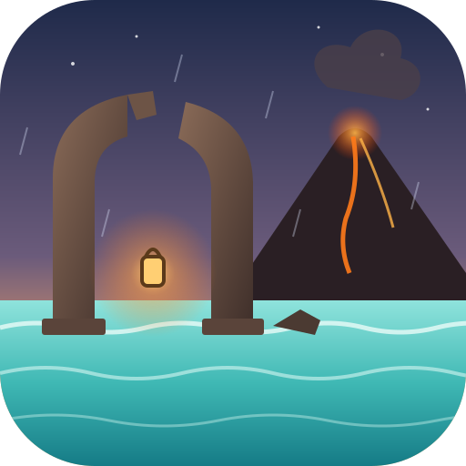</p>

<h1 align="center">The Ruins of Bezan</h1>
<p align="center">A rain-soaked 3D exploration game in C and OpenGL 4.5,<br>made entirely by conversation with Claude, one prompt at a time.</p>

<p align="center">
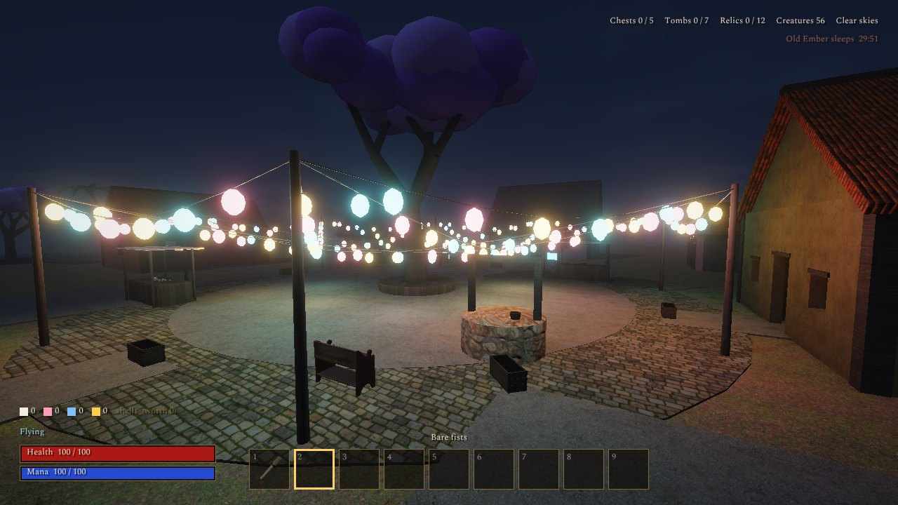 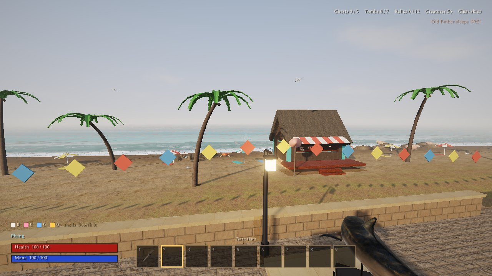
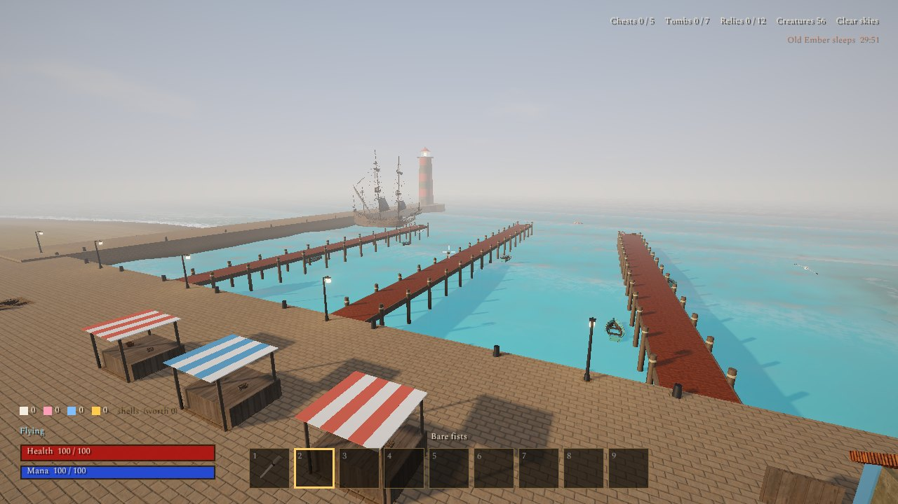 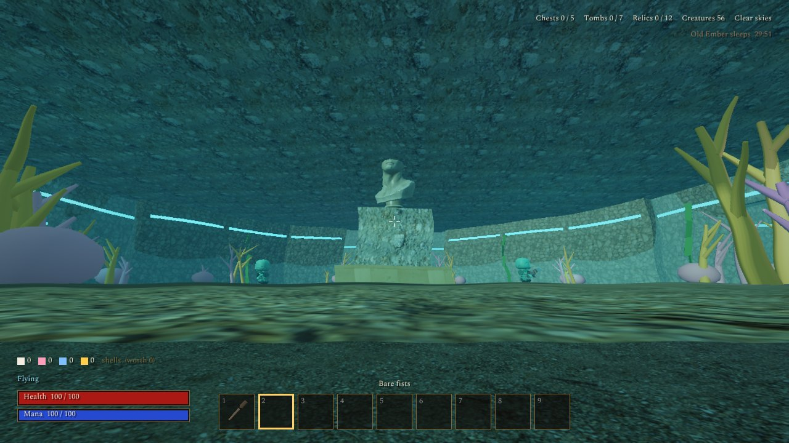
</p>

## What it is

You wake by a shrine among broken pillars in the rain. The ruins have halls, a library, a flooded hall full of
slimes, a crypt of sleeping skeletons with spell tombs, and a palace whose residents talk (with real voices). Beyond
the ruins lies the coast:

- **The beach** — pale sand into chalky turquoise water, palms, parasols, surf breaking on the shore, the walrus
  rocks (the walruses whistle to each other across the water, answer each other in a chorus, whistle along to your
  ukulele, and whistle for fish), hermit crabs, gulls, turtles, fish shoals, dolphins… and jellyfish and sharks.
- **The Curious Clam**, a beach shop that takes **shells** as money — white, pink, blue and gold, found on the sand,
  earned from odd jobs on the notice board, or paid for fish — and sells rods, bait, novelties (a garden gnome that
  distracts monsters, a ukulele, a metal detector for buried treasure, a magnifying glass, a lucky elephant) and treats.
- **The promenade** — lamps, benches, bunting, bronze sea creatures on plinths, stone tablets carrying the coast's
  history, and **the Hall of Tides**, a museum whose twelve pedestals fill up as you find the relics of the First Tide.
- **The marina** — a stone quay, piers with **rowing boats** you can take out to sea, a moored ship, the
  harbourmaster's office, a fish market, and the breakwater out to the lighthouse, where on clear nights
  **the Unmoored**, someone older than the sea, waits — and can hardly be seen.
- **Brinewick**, a fishing village of pastel plaster and thatch on a low hill: paper lanterns criss-crossing the square
  under a great blossom tree, shell-mosaic lanes, wind chimes, washing on the line, a tavern with its own reel,
  a smith, a bell tower with no bell, a lantern shrine on the cliff, and a cove below.
- **Old Ember**, a volcano that **erupts every 30 minutes**: two minutes of tremors and warnings, then lava bombs and a
  burning cloud that rolls across the whole coast killing everything out in the open (you included), an ash fall, and
  then the Covenant brings everything back to life. Its crater's fumes are poison — **this is what the gas mask is
  for** (the ash, too).
- **The Drowned Court**, a palace on the sea floor under a glass dome, reachable only by blowing the **Conch of the
  Deep** — a catch from the fishing mini-game — at the bell buoy far out at sea. Three puzzles (a bell gallery, a tide
  engine, a pearl garden), barnacled Drowned guards, angler eels, and the Drowned King, who keeps Brinewick's bell.

**The Ember and the Tide** ties it together: relight the shrine lanterns, find the harbourmaster's lost tide charts,
learn to fish, fetch Old Ember's heart for the smith's ember lures, hook the Conch, open the Court, and bring the bell
home to a festival. Side quests: the twelve relics (and the Unmoored's very rare gift), the walrus chorus, Old Brine's
golden snapper, and the notice board's jobs. Press **J** for the journal.

Also new in this version: **swimming** (with stamina and breath, diving, climbing out onto piers; lengthened by the
Tome of Gills, the diving helm, and rare catches; boats never tire you), **fishing** with four rod tiers and four
baits, **third-person view** (V) with **visible armour and clothes** (the knight's plate and helm, the barbarian's furs,
the magister's robes and hats, capes, a fisherman's hat, a brass diving helmet), eleven new weapons, seven new spells,
nine new kinds of creature, wind storms, hail and tornadoes, eleven new music moods in new genres and around seventy
new sound effects — all synthesized in code.

<p align="center">
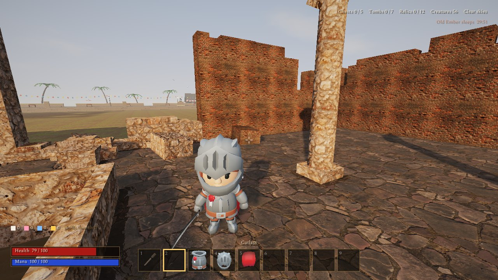 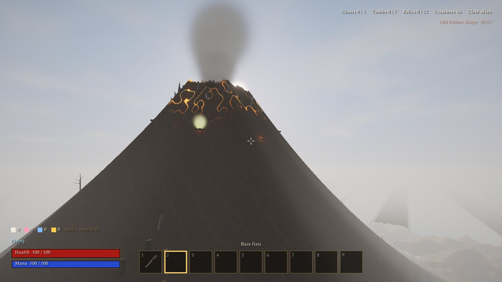 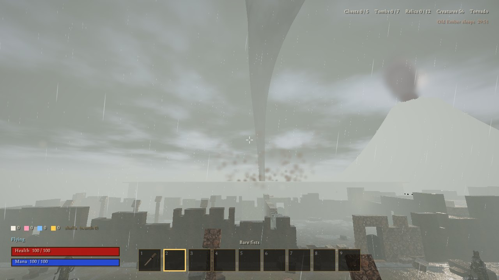
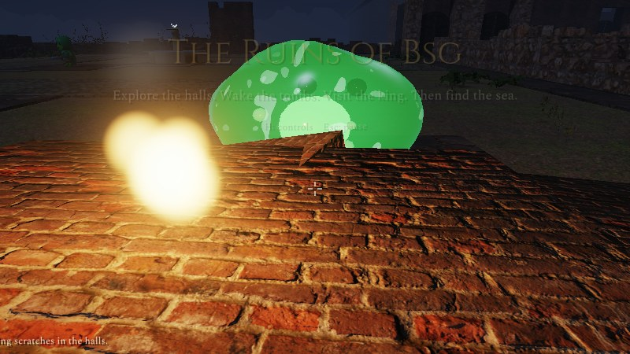 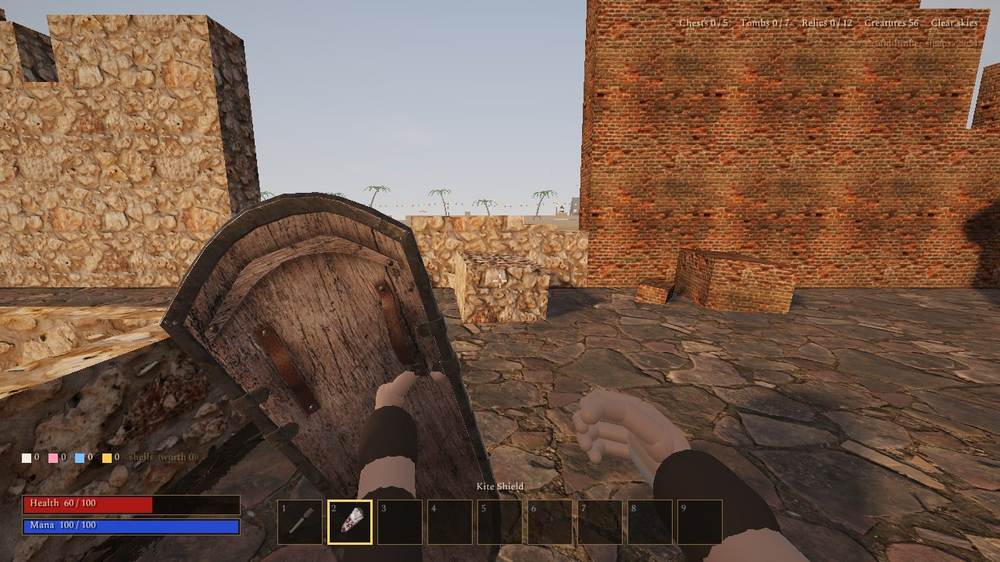 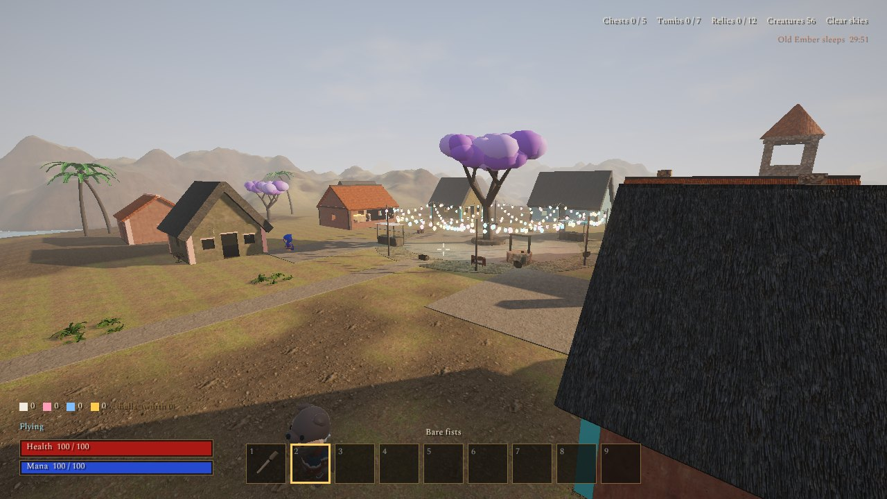
</p>

## Building and running

Needs a C17 compiler, `make`, `pkg-config` and [SDL3](https://libsdl.org), and a GPU with OpenGL 4.5.
Everything else (glad, cglm, cgltf, stb) is in `deps/`.

```sh
# Arch / CachyOS:  sudo pacman -S sdl3 gcc make pkgconf
make run
```

Run it from the project folder (it loads `assets/` and `shaders/` from there).
`./build/bezan --shot out.png --frames 90 [--cam x y z yaw pitch] [--fly] [--third] [--weather n] [--volcano seconds]`
renders a moment to a PNG without opening a window (that's how every change was checked).

## Controls

| Key | | Key | |
|---|---|---|---|
| WASD | move / swim / row | Mouse | look |
| Shift | sprint | Space | jump / swim up / climb out |
| C / Ctrl | crouch / dive | Left click | attack, cast, use, fish |
| Right click | block, zoom, throw the harpoon | E | open, take, talk, board or leave a boat |
| T | off hand: torch, lantern, shield | G | drop the held item |
| 1–9 / wheel | choose an item | Tab / I | satchel and what you wear |
| J | journal | V | third person |
| − / = | camera distance | N | day / night |
| F2 | change the weather | F4 | wake Old Ember now (for testing) |
| F10 | free orbit camera | M | music on / off |
| F12 | screenshot | Esc | pause, options |

A gamepad works too (see the controls screen, H).

## How it's made

Everything is plain C (about 20,000 lines) on top of SDL3 and OpenGL 4.5: a glTF loader with skinning and
animation, a PBR renderer with sun shadows, bloom and ACES tone mapping, rain puddles and ripples, and — new —
a heightmap-shaped world, an ocean with swell, surf and caustics, underwater fog and a Snell's window, lava, a
tornado and a glossy slime shader. All the architecture (ruins, village, marina, the Court), the hands, slimes,
walruses, fish, sharks, boats, rods, bells and many props are generated in code. All music and sound effects are
synthesized live (`audio.c`); only the characters' voices are recordings, rendered offline with Piper
(`tools/make_voices.sh`). `tools/fetch_assets.py` downloads the Poly Haven assets the coast uses.

## Asset sources

Full credits and licenses are in [CREDITS.md](CREDITS.md); every download URL used by `tools/fetch_assets.py` is
listed in [assets/SOURCES.txt](assets/SOURCES.txt).

**Characters**
- KayKit Character Pack: Adventurers and Skeletons, by Kay Lousberg (CC0) — <https://kaylousberg.itch.io/kaykit-adventurers>, <https://kaylousberg.itch.io/kaykit-skeletons>
- Fox, Khronos glTF Sample Assets (CC0 model, CC BY 4.0 rig and animation) — <https://github.com/KhronosGroup/glTF-Sample-Assets/tree/main/Models/Fox>
- Avocado, Khronos glTF Sample Assets (CC0) — <https://github.com/KhronosGroup/glTF-Sample-Assets/tree/main/Models/Avocado>

**Models from Poly Haven** (CC0), each at `https://polyhaven.com/a/<name>`

|   |   |   |   |
|---|---|---|---|
| [antique_ceramic_vase_01](https://polyhaven.com/a/antique_ceramic_vase_01) | [antique_estoc](https://polyhaven.com/a/antique_estoc) | [antique_katana_01](https://polyhaven.com/a/antique_katana_01) | [ArmChair_01](https://polyhaven.com/a/ArmChair_01) |
| [bananas](https://polyhaven.com/a/bananas) | [Barrel_01](https://polyhaven.com/a/Barrel_01) | [book_encyclopedia_set_01](https://polyhaven.com/a/book_encyclopedia_set_01) | [boombox](https://polyhaven.com/a/boombox) |
| [boulder_01](https://polyhaven.com/a/boulder_01) | [brass_diya_lantern](https://polyhaven.com/a/brass_diya_lantern) | [brass_goblets](https://polyhaven.com/a/brass_goblets) | [bronze_ray_statue](https://polyhaven.com/a/bronze_ray_statue) |
| [bronze_shark_statue](https://polyhaven.com/a/bronze_shark_statue) | [bronze_whale_statue](https://polyhaven.com/a/bronze_whale_statue) | [cannon_01](https://polyhaven.com/a/cannon_01) | [carved_wooden_elephant](https://polyhaven.com/a/carved_wooden_elephant) |
| [CashRegister_01](https://polyhaven.com/a/CashRegister_01) | [ceramic_vase_02](https://polyhaven.com/a/ceramic_vase_02) | [Chandelier_02](https://polyhaven.com/a/Chandelier_02) | [CheeseBox_01](https://polyhaven.com/a/CheeseBox_01) |
| [chess_set](https://polyhaven.com/a/chess_set) | [croissant](https://polyhaven.com/a/croissant) | [crowbar_01](https://polyhaven.com/a/crowbar_01) | [dutch_ship_large_02](https://polyhaven.com/a/dutch_ship_large_02) |
| [dutch_ship_medium](https://polyhaven.com/a/dutch_ship_medium) | [fern_02](https://polyhaven.com/a/fern_02) | [fishermans_hat](https://polyhaven.com/a/fishermans_hat) | [flower_empodium](https://polyhaven.com/a/flower_empodium) |
| [food_lime_01](https://polyhaven.com/a/food_lime_01) | [food_pomegranate_01](https://polyhaven.com/a/food_pomegranate_01) | [garden_gnome](https://polyhaven.com/a/garden_gnome) | [gothic_statue](https://polyhaven.com/a/gothic_statue) |
| [GothicCabinet_01](https://polyhaven.com/a/GothicCabinet_01) | [GothicCommode_01](https://polyhaven.com/a/GothicCommode_01) | [hatchet](https://polyhaven.com/a/hatchet) | [horse_statue_01](https://polyhaven.com/a/horse_statue_01) |
| [kite_shield](https://polyhaven.com/a/kite_shield) | [lambis_shell](https://polyhaven.com/a/lambis_shell) | [Lantern_01](https://polyhaven.com/a/Lantern_01) | [lantern_chandelier_01](https://polyhaven.com/a/lantern_chandelier_01) |
| [large_castle_door](https://polyhaven.com/a/large_castle_door) | [lateral_sea_marker](https://polyhaven.com/a/lateral_sea_marker) | [lifebuoy](https://polyhaven.com/a/lifebuoy) | [lion_head](https://polyhaven.com/a/lion_head) |
| [machete](https://polyhaven.com/a/machete) | [magnifying_glass_01](https://polyhaven.com/a/magnifying_glass_01) | [marble_bust_01](https://polyhaven.com/a/marble_bust_01) | [metal_detector](https://polyhaven.com/a/metal_detector) |
| [moon_rock_01](https://polyhaven.com/a/moon_rock_01) | [moon_rock_03](https://polyhaven.com/a/moon_rock_03) | [ocean_buoy](https://polyhaven.com/a/ocean_buoy) | [old_gas_mask](https://polyhaven.com/a/old_gas_mask) |
| [ornate_medieval_dagger](https://polyhaven.com/a/ornate_medieval_dagger) | [ornate_medieval_mace](https://polyhaven.com/a/ornate_medieval_mace) | [ornate_mirror_01](https://polyhaven.com/a/ornate_mirror_01) | [ornate_war_hammer](https://polyhaven.com/a/ornate_war_hammer) |
| [painted_wooden_bench](https://polyhaven.com/a/painted_wooden_bench) | [painted_wooden_chair_01](https://polyhaven.com/a/painted_wooden_chair_01) | [painted_wooden_shelves](https://polyhaven.com/a/painted_wooden_shelves) | [painted_wooden_table](https://polyhaven.com/a/painted_wooden_table) |
| [picke_dirty_01](https://polyhaven.com/a/picke_dirty_01) | [planter_box_01](https://polyhaven.com/a/planter_box_01) | [pocket_watch](https://polyhaven.com/a/pocket_watch) | [potted_plant_02](https://polyhaven.com/a/potted_plant_02) |
| [potted_plant_04](https://polyhaven.com/a/potted_plant_04) | [rock_moss_set_01](https://polyhaven.com/a/rock_moss_set_01) | [round_spectacles](https://polyhaven.com/a/round_spectacles) | [rubber_boots](https://polyhaven.com/a/rubber_boots) |
| [rubber_duck_toy](https://polyhaven.com/a/rubber_duck_toy) | [rusted_spade_01](https://polyhaven.com/a/rusted_spade_01) | [seadogs_compass](https://polyhaven.com/a/seadogs_compass) | [shrub_02](https://polyhaven.com/a/shrub_02) |
| [shrub_03](https://polyhaven.com/a/shrub_03) | [shrub_sorrel_01](https://polyhaven.com/a/shrub_sorrel_01) | [sledgehammer_01](https://polyhaven.com/a/sledgehammer_01) | [spinning_wheel_01](https://polyhaven.com/a/spinning_wheel_01) |
| [stick_grenade](https://polyhaven.com/a/stick_grenade) | [stone_fire_pit](https://polyhaven.com/a/stone_fire_pit) | [street_rat](https://polyhaven.com/a/street_rat) | [sweet_potato](https://polyhaven.com/a/sweet_potato) |
| [tea_set_01](https://polyhaven.com/a/tea_set_01) | [treasure_chest](https://polyhaven.com/a/treasure_chest) | [tree_stump_01](https://polyhaven.com/a/tree_stump_01) | [Ukulele_01](https://polyhaven.com/a/Ukulele_01) |
| [vintage_binocular](https://polyhaven.com/a/vintage_binocular) | [vintage_oil_lamp](https://polyhaven.com/a/vintage_oil_lamp) | [weed_plant_02](https://polyhaven.com/a/weed_plant_02) | [wicker_basket_01](https://polyhaven.com/a/wicker_basket_01) |
| [wine_barrel_01](https://polyhaven.com/a/wine_barrel_01) | [wooden_axe](https://polyhaven.com/a/wooden_axe) | [wooden_axe_02](https://polyhaven.com/a/wooden_axe_02) | [wooden_barrels_01](https://polyhaven.com/a/wooden_barrels_01) |
| [wooden_bookshelf_worn](https://polyhaven.com/a/wooden_bookshelf_worn) | [wooden_bucket_01](https://polyhaven.com/a/wooden_bucket_01) | [wooden_bucket_02](https://polyhaven.com/a/wooden_bucket_02) | [wooden_candlestick](https://polyhaven.com/a/wooden_candlestick) |
| [wooden_crate_01](https://polyhaven.com/a/wooden_crate_01) | [wooden_handle_saber](https://polyhaven.com/a/wooden_handle_saber) | [wooden_lantern_01](https://polyhaven.com/a/wooden_lantern_01) | [wooden_picnic_table](https://polyhaven.com/a/wooden_picnic_table) |
| [WoodenTable_02](https://polyhaven.com/a/WoodenTable_02) |   |   |   |

**Textures from Poly Haven** (CC0)

|   |   |   |   |
|---|---|---|---|
| [blue_plaster_weathered](https://polyhaven.com/a/blue_plaster_weathered) | [burned_ground_01](https://polyhaven.com/a/burned_ground_01) | [castle_brick_07](https://polyhaven.com/a/castle_brick_07) | [clay_roof_tiles_02](https://polyhaven.com/a/clay_roof_tiles_02) |
| [coast_sand_01](https://polyhaven.com/a/coast_sand_01) | [coral_fort_wall_01](https://polyhaven.com/a/coral_fort_wall_01) | [coral_ground_02](https://polyhaven.com/a/coral_ground_02) | [coral_stone_wall](https://polyhaven.com/a/coral_stone_wall) |
| [damp_beach_sand](https://polyhaven.com/a/damp_beach_sand) | [dark_rock](https://polyhaven.com/a/dark_rock) | [forest_ground_04](https://polyhaven.com/a/forest_ground_04) | [herringbone_parquet](https://polyhaven.com/a/herringbone_parquet) |
| [leafy_grass](https://polyhaven.com/a/leafy_grass) | [low_tide_rocks](https://polyhaven.com/a/low_tide_rocks) | [marble_01](https://polyhaven.com/a/marble_01) | [marble_mosaic_tiles](https://polyhaven.com/a/marble_mosaic_tiles) |
| [medieval_blocks_02](https://polyhaven.com/a/medieval_blocks_02) | [monastery_stone_floor](https://polyhaven.com/a/monastery_stone_floor) | [mossy_cobblestone](https://polyhaven.com/a/mossy_cobblestone) | [mossy_sandstone](https://polyhaven.com/a/mossy_sandstone) |
| [mossy_stone_wall](https://polyhaven.com/a/mossy_stone_wall) | [old_planks_02](https://polyhaven.com/a/old_planks_02) | [old_wood_floor](https://polyhaven.com/a/old_wood_floor) | [palm_bark](https://polyhaven.com/a/palm_bark) |
| [red_plaster_weathered](https://polyhaven.com/a/red_plaster_weathered) | [red_sandstone_wall](https://polyhaven.com/a/red_sandstone_wall) | [rock_face](https://polyhaven.com/a/rock_face) | [sandstone_blocks_08](https://polyhaven.com/a/sandstone_blocks_08) |
| [seaworn_sandstone_brick](https://polyhaven.com/a/seaworn_sandstone_brick) | [seaworn_stone_tiles](https://polyhaven.com/a/seaworn_stone_tiles) | [shell_floor_01](https://polyhaven.com/a/shell_floor_01) | [thatch_roof_angled](https://polyhaven.com/a/thatch_roof_angled) |
| [velour_velvet](https://polyhaven.com/a/velour_velvet) | [weathered_planks](https://polyhaven.com/a/weathered_planks) | [white_plaster_rough_01](https://polyhaven.com/a/white_plaster_rough_01) | [white_sandstone_blocks_02](https://polyhaven.com/a/white_sandstone_blocks_02) |
| [wood_floor_deck](https://polyhaven.com/a/wood_floor_deck) | [yellow_plaster](https://polyhaven.com/a/yellow_plaster) |   |   |

**Fonts** — Cinzel by Natanael Gama and Spectral by Production Type (SIL OFL 1.1): <https://fonts.google.com/specimen/Cinzel>, <https://fonts.google.com/specimen/Spectral>

**Voices** — [Piper](https://github.com/rhasspy/piper) text-to-speech with voices from <https://huggingface.co/rhasspy/piper-voices>:
`en_GB-cori-high` (public-domain LibriVox data) and `en_GB-vctk-medium` (the CSTR VCTK Corpus, University of Edinburgh, CC BY 4.0).

**Libraries** — [SDL3](https://libsdl.org) (zlib), [glad](https://github.com/Dav1dde/glad), [cglm](https://github.com/recp/cglm) (MIT),
[cgltf](https://github.com/jkuhlmann/cgltf) (MIT), [stb](https://github.com/nothings/stb) (public domain / MIT).

---

<sub>

### The prompts used to make it

Every request made to Claude while building this game, in order, word for word (typos and all).

**Session 1 — from a spinning triangle to the ruins**

> can you install the c libraries for modern opengl 4.5 , cglm, glad and whatever is the best multimedia multi-system  library for opening a window

> can you set that all up for me

> glm_lookat((vec3){0.0f, 0.0f, 1.0f}, (vec3){0.0f, 0.0f, 0.0f}, (vec3){0.0f, 1.0f, 0.0f}, view);
>
> what are each parameter doing

> can we not attach color to vertex positions ; etc

> sure !

> glm_translate how does it work

> glm_translate(model, (vec3){shit_value-t/2, 0.0f, 0.0f});
>
> I don't understand; how to make the translation go left and right like a ping pong maybe it's more simpler by just changing the - and + but how to know when ?

> can we make the shader reading code from files please

> can you download a public domain gltf file and also setup cgltf with modern opengl and also setup stb_image too

> do all of it

> *(a screenshot)*

> can we add a first person camera and keep this current 3rd person camera also add a simple way to toggle between them .
>
> can we add 3d terrain as well

> can we add a bunch of 3d models that are bone animated on the scene and also add 3d hands that are reactive to the controls and scene.
>
> Id like a 3d textured and beautful ruins that's relatively large with various interactive elements like ruin doors, light torches that are usable, treasure chests with crazy items in them, simple and easy creatures to kill.
>
> can we also have weapons and inventory.

> blank screen ? and can we add some lovely ambient but melodic music and ambient sounds and sound effects

> can we add more music varieties make upstair and downstairs of the ruins ; fix up the visual glitches like arms being detached from a body base, the 3d in-use weapons and so on taking up the entire field of view, add more variety of ruin area's, add a proper weather system with rain being the default, add magical tombs and magical spells also can we have some skeletons, goblins, slimey creatures also better controls in all areas.
>
> can we have portable usable laterns, torches on walls.
>
> can we add a beautiful palace with vocal talking npcs that talk about made up very short stories as well.


**Session 2 — tidying, and transforms for every model**

> is this code well optimized and simplified to it's bare workable language?

> can you check the overall project ?

> go ahead aslong as it's not that dead code of that triangle; I want it there

> can we make it so all models can be rotated, translated and scaled etc instead of having to rewrite whole entire code bases if you have to do that then fine.


**Session 3 — the coast, Brinewick, Old Ember and the Drowned Court**

> can you put this entire project into my github as a repo and call it Generative Games and put the readme the prompts used to make it and known hand edits in the subtext also add a lovely icon that signifies the game aesthetic, vibe and also list the urls for all the asset sourcing ; etc 
>
> while we are add it can we add more music (also more genres aslong as it fits the aesthetic) and keep the ones currently intact and add an collectable quest line and chain with new objects to interact with.
>
> add more spells
> add more variety of enemies 
>
> fix the slime monster it doesn't look like a shiny reflective liquidy moving slime monster
>
> the ornamental statues near the castle are small instead of there proper size like the horse statue and so on.
>
> the axe is not the correct orientation
>
> the gas mask doesn't really sit in the hand but goes through the middle of it.
>
> there's no reason to use the gas mask can you add one.
>
>
> can you add a village with special aesthetic and storyline including npcs.
>
>  add an swimming to the players and npcs (that can be extended by spell or ability but not last long as a docked boat)
>
> add chalky cyan and correctly themed water ocean with a sandy beach entrance and a beach shop to get cool novelty and strange items with varied colored shell currency as payment or helping out.
>
> add aquatic animals in ocean on the beach and on the promenade that are harmless and one or two that are harmful. (would love to see walruses doing there whistle around here heavily inspired by tiktok walrus whistle)
>
> add a beach-sized promenade and marina with anicent collectables and history including a mysterious weird npc that has super anicent lore and a very rare item and hard to find and see
>
> can we add a fishing mini-game that gets you special aquatic abilities with fishing rods that have tiers , various baits and novelties.
>
> add an under the ocean palace with monsters, interesting puzzles and really cool aesthetics that is only accessible from getting a special item from the fishing mini-game.
>
> add a lot more music , sound effects.
>
> add the ability to see yourself in third person.
>
> Oh and can we have a volcano on the map somewhere that does erupt every 30 minutes; wiping out everything then they regenerate back to life again.
>
> add tornado's , wind storms and hail weather.
>
> add more weapons, 
> fix shield orientation
> add armour, clothes ; etc that is visible

> I added github-cli :)

> carry on

> can we rename the entire project folder, game and repo too:
>
> The Ruins of Bezan


### Known hand edits

Parts of the code were written or changed by hand rather than by Claude, and are kept as they are:

- **`main.c` — the triangle.** The original first-lesson triangle still spins in the world at the altar, on purpose
  ("go ahead aslong as it's not that dead code of that triangle; I want it there"). Its loop code is hand-edited: the
  ping-pong `x`/`dir`/`speed`/`limit` variables before the loop (`x += dir * speed`, bouncing at ±10), translating by
  `(x, x, 0)` and scaling by `(8, 8, 1)` after `glm_rotate_make(model, t, (1, 1, 1))`, the colour uniform set to
  `0.0f + 0.0f * sinf(t)` (so the shader's gradient shows), and the comments
  `//THIS IS MOVING THE CAMERA; THE TRIANGLE HASN'T MOVED.` and `// before the while loop`, with the original
  indentation.
- **`shaders/basic.vert` / `shaders/basic.frag` — the triangle's gradient.** A per-vertex `v_gradientFactor`
  (`a_pos.x + 0.5`, with options B and C left in comments) and a red-to-green `mix`, plus the unused `u_resolution`
  and orange/blue constants.
- **`level.c` — `pillar()`.** `static float change = 1.0f;` and a `glm_rotate(xf, change, (1, 0, 0))` that tips every
  pillar's capital by one radian (the tilted capitals you see around the shrine), with a stray `;` and blank lines;
  and the comment `//height of walls` in `wall_height()`.
- **`settings.cfg`** is written by the game's options menu and isn't part of the repository.

</sub>
